# ELT Pipeline with Snowflake, dbt, and Airflow

This repository contains an end-to-end ELT pipeline built using Snowflake, dbt, Airflow, and Cosmos.  
The project demonstrates how to model, transform, and orchestrate data in a modern analytics engineering workflow.

## Project Structure

```mermaid
flowchart LR

    %% --- Raw Layer ---
    A[🍃 CSV / TPCH Raw Data] --> B

    %% --- Airflow ingestion ---
    B[[🌀 Airflow<br/>Load Raw Data into Snowflake]] --> C

    %% --- Staging + Quality Checks ---
    C --> D((🔍 Quality Checks))
    D --> E[[🏗️ dbt Staging Models]]

    %% --- Intermediate + Quality Checks ---
    E --> F((🔍 Quality Checks))
    F --> G[[🔧 dbt Intermediate Models]]

    %% --- Fact / Mart + Quality Checks ---
    G --> H((🔍 Quality Checks))
    H --> I[[📊 dbt Fact & Mart Models]]

    %% --- BI Layer ---
    I --> J[📈 BI Dashboard / Reporting]

    %% --- Optional blue outline like your diagram ---
    classDef pipeline stroke:#3fa9f5,stroke-width:2px,stroke-dasharray:6 4,fill:none;
    class B,D,E,F,G,H,I pipeline;
```




Below are the key directories and files of this project (non-essential auto-generated folders omitted):

```
.
├── Dockerfile
├── airflow_settings.yaml
├── requirements.txt
├── packages.txt
│
├── dags/
│   ├── dbt_dag.py
│   └── dbt/
│       └── snowflake_demo/
│           ├── dbt_project.yml
│           ├── packages.yml
│           ├── models/
│           │   ├── staging/
│           │   │   ├── stg_tpch_orders.sql
│           │   │   ├── stg_tcph_line_items.sql
│           │   │   └── tpch_sources.yml
│           │   └── marts/
│           │       ├── int_order_items.sql
│           │       ├── int_order_items_summary.sql
│           │       ├── fct_orders.sql
│           │       └── generic_test.yml
│           │
│           ├── macros/
│           │   └── pricing.sql
│           │
│           ├── tests/
│           │   ├── fct_orders_discount.sql
│           │   └── fct_orders_orderdate.sql
│           │
│           └── seeds/ (empty)
│
└── README.md
```

## Components

### dbt Models
- **staging/**  
  Cleans, renames, and standardizes raw TPCH data.

- **marts/**  
  Contains intermediate models and the main fact table `fct_orders`.

- **macros/**  
  Reusable SQL logic, including a pricing macro.

- **tests/**  
  Custom singular tests validating `fct_orders`.

### Airflow DAG
`dags/dbt_dag.py` orchestrates dbt runs using Cosmos.

### Configuration Files
- `dbt_project.yml` — dbt settings  
- `packages.yml` — dbt dependencies  
- `Dockerfile` — Airflow image customization  
- `requirements.txt` — Python dependencies  


## Running airflow

```
# This line will start the project
astro dev start

# This line will stop the project
astro dev stop
```

## Running dbt

```
dbt run
dbt test
dbt run -s staging_file
dbt run -s marts_file
```

## Example Snowflake Profile

```
snowflake_demo:
  target: dev
  outputs:
    dev:
      type: snowflake
      account: <your_account>.europe-west4.gcp
      user: <your_user>
      password: <your_password>
      role: <your_role>
      warehouse: DBT_WH
      database: DBT_DB
      schema: DBT_SCHEMA
```

## Purpose

This project serves as a minimal but complete example of how to build a production-style ELT workflow using:

- Snowflake for storage  
- dbt for transformation and data modeling  
- Airflow (Cosmos) for orchestration  

It is intended as a reference implementation for learning or extending into a full data platform.

